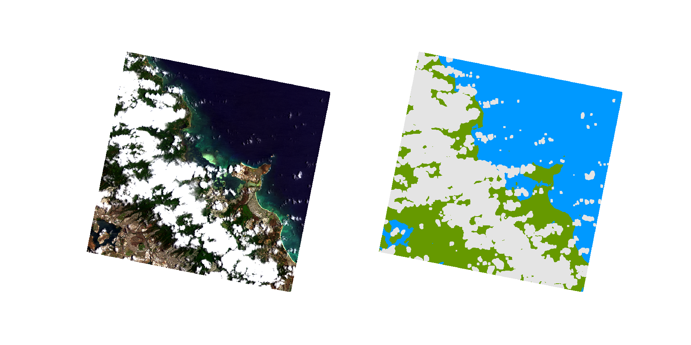

# sister-cloudmask
This repository contains a series of algorithms for cloud masking of hyperspectral imagery.

## CNN classifier

The classifier is a two-step process:
1. A 1D CNN is used to perform and initial pixel-wise classifiction
2. A set of median and dilation filters are used to filter out stray pixels and buffer around clouds.

The models were trained using PRISMA (VNIR and VSWIR models) and DESIS (VNIR model) spaceborne radiance data.

## HyCMA classifier

This classifier is based on the HyspIRI Cloud Mask Detection Algorithm (HyCMA) and uses a series
of thresholds on individual bands, indices and band ratios. Thresholds were adjusted to maximize
cloud detection accuracy in PRISMA imagery.

HyspIRI Cloud Mask Detection Algorithm Theoretical Basis Document
Hulley, Glynn C.; Hook, Simon J.
[http://hdl.handle.net/2014/42573](http://hdl.handle.net/2014/42573)